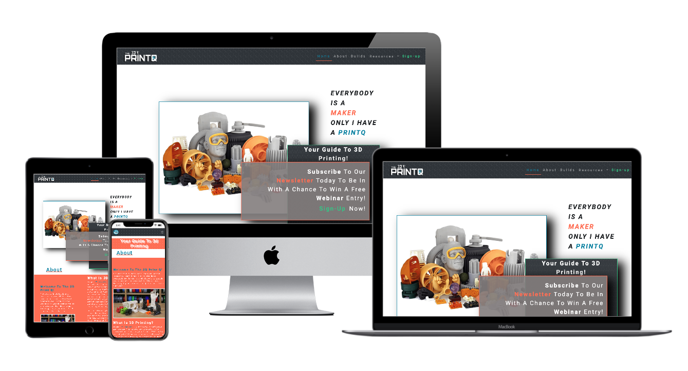
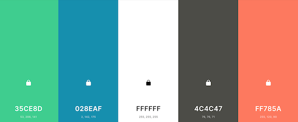
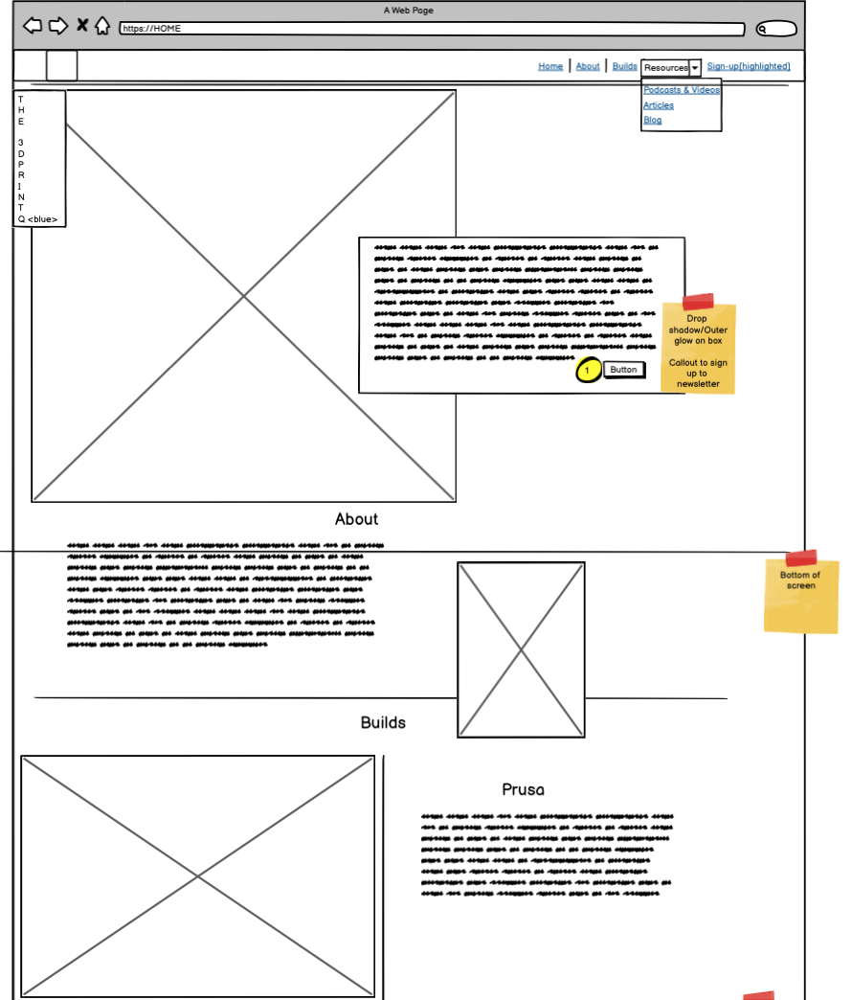
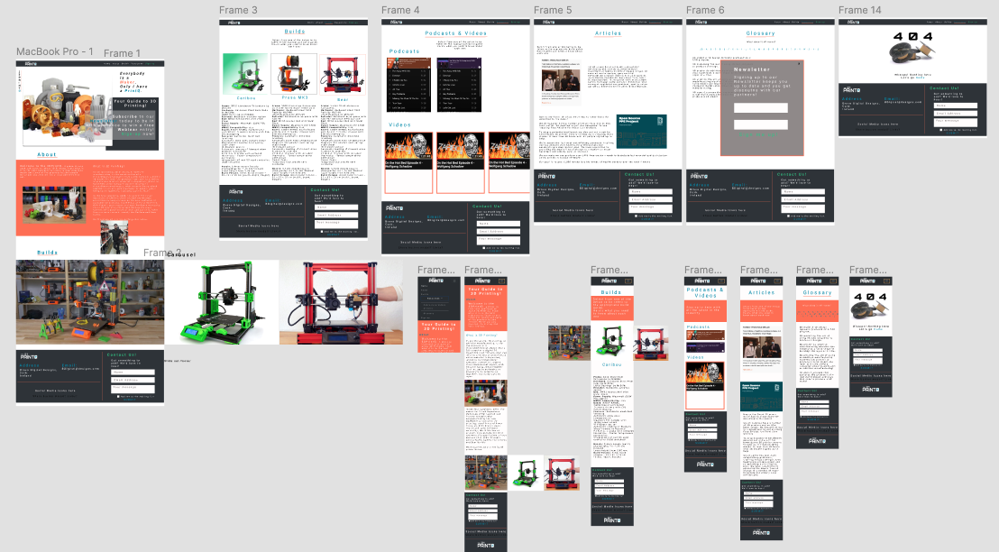
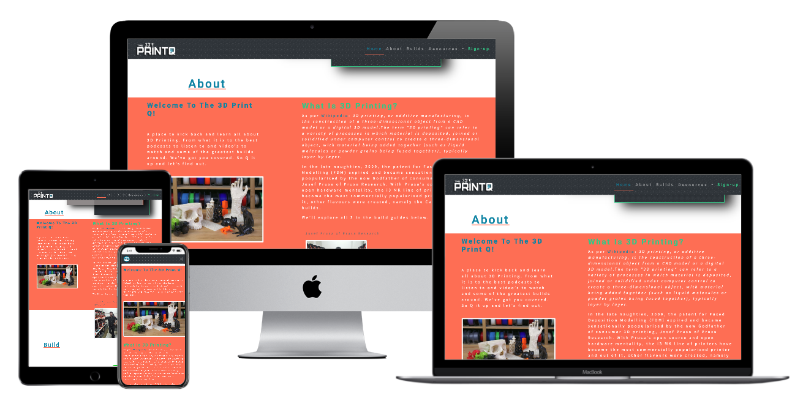
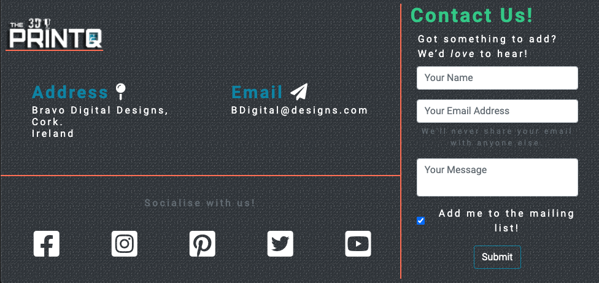
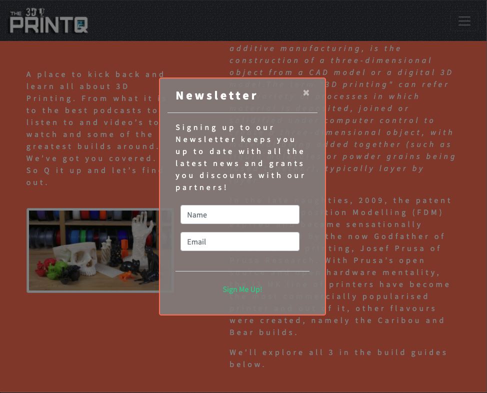

## Table of contents
----

  

- [Overview](#Milestone-Project-1 "Milestone Project 1")  
- [The 3D Print Q](#The-3D-Print-Q "The 3D Print Q")  
- [User Experience](#user-experience-(ux) "User Experience")  
   - [User Stories](#user-stories "User Stories")  
        - [First Time Visitor Goals](#first-time-visitor-goals "First Time Visitor Goals")  
        - [Returning Visitor Goals](#returning-visitor-goals "Returning Visitor Goals")  
        - [Frequent User Goals](#frequent-user-goals "Frequent User Goals")  
- [Design](#design "Design")  
    - [Colour Scheme](#colour-scheme "Colour Scheme")  
    - [Typography](#typography "Typography")  
    - [Imagery](#imagery "Imagery")  
    - [Wireframes](#wireframes "Wireframes")  
- [Features](#features "Features")  
- [Technologies Used](#technologies-used "Technologies Used")  
    - [Languages Used](#languages-used "Languages Used")  
        - [HTML5](#html5 "HTML5")  
        - [CSS3](#css3 "CSS3")  
        - [Javascript/Query](#javascript/query "Javascript/Query")  
- [Frameworks, Libraries & Programs used](#frameworks-libraries-&-programs-used "Frameworks, Libraries & Programs used")  
    - [Bootstrap v.4.5.3](#bootstrap-v.4.5.3 "Bootstrap v.4.5.3")  
    - [Hover.css](#hover.css "Hover.css  ")  
    - [Google Fonts](#google-fonts "Google Fonts")  
    - [Font Awesome](#font-awesome "Font Awesome")  
    - [Favicon](#favicon "Favicon")  
    - [Freephototool](#freephototool "Freephototool")  
    - [Balsamic](#balsamic "Balsamic")  
    - [Figma](#figma "Figma")  
    - [Coolors.co](#coolors.co "Coolors.co")  
    - [jQuery](#jquery "jQuery")  
    - [Git](#git "Git")  
    - [GitHub](#github "GitHub")  
    - [Gitpod](#gitpod "Gitpod")  
- [Testing](#testing "Testing")  
        - [Testing User Stories from User Experience (UX)](#testing-user-stories-from-user-experience-(ux) "Testing User Stories from User Experience (UX) Section")  
        - [First Time Visitor Goals](#first-time-visitor-goals "First Time Visitor Goals")  
        - [Returning Visitor Goals](#returning-visitor-goals "Returning Visitor Goals")  
        - [Frequent User Goals](#frequent-user-goals "Frequent User Goals")  
    - [Further Testing](#further-testing "Further Testing")  
    - [Known Bugs](#known-bugs "Known Bugs")  
- [Deployment](#deployment "Deployment")  
    - [Using Github Pages](#using-github-pages "Using Github Pages")  
    - [Local Clone](#local-clone "Local Clone")  
    - [Development](#development "Development")  
    - [Bugs & Feature Requests](#bugs-&-feature-requests "Bugs & Feature Requests")  
- [Credits](#credits "Credits")  
    - [Code](#code "Code")  
    - [Content](#content "Content")  
    - [Media](#media "Media")  
    - [Acknowledgements](#acknowledgements "Acknowledgements")  
    

# Milestone Project 1
        
     

This was created to demonstrate learnings from the Code Institute software development course and marks the first of four milestone projects to be created. It is to showcase html, css and ux by way of a static front end website.

## The 3D Print Q

The3DPrintQ website is a fully responsive website designed to introduce hobbyists to 3D printing. It explains what 3D printing is and directs users to common ‘builds’ so that they can build their own! For the site owner, it’s purpose is to capture email addresses so as to promote paid content and affiliate links. 
The site can be viewed [here](https://logisticbravo.github.io/Milestone_Project-1-3DPrintQ/).

## User Experience (UX)
### User stories
#### First Time Visitor Goals
* As a First Time Visitor, I want to easily understand the main purpose of the site and learn more about the organisation.
* As a First Time Visitor, I want to be able to easily navigate throughout the site to find content.
* As a First Time Visitor, I want to access the site across a range of devices.
#### Returning Visitor Goals
* As a Returning Visitor, I want to find additional relevant information.
* As a Returning Visitor, I want to get in contact with the site owner with questions. 
* As a Returning Visitor, I want to locate their social media links to stay up to date with content.
#### Frequent User Goals
* As a Frequent User, I want to check to see if there are any newly added podcasts or videos. 
* As a Frequent User, I want to check to see if there are any new blog posts.
* As a Frequent User, I want to sign up to the Newsletter so that I am emailed any major updates and/or changes to the website or organisation.

### Design
#### Colour Scheme
The site uses the following 5 colours primarily.   

* Green - rgb(53,206,141) #35CE8D
* Blue - rgb(2,142,175) #028EAF
* White - rgb(255,255,255) #FFFFFF
* Grey - rgb (76,76,71) #4C4C47
* Orange - rgb(255,120,90) #FF785A
#### Typography
* The Roboto font is used on navigational and header elements throughout the site with sans serif as a fall back in case of errors in loading the font. Roboto is a clean and stylish popular choice as Androids default font and so fits the target market of those that are more ‘tech’ orientated. 
* Source Sans Pro is used for all content elements as it is intended for user interface elements and so is a fitting nod to user input screens on 3D printers. 
#### Imagery
The hero image was chosen to show the wide range of things of which an be 3D printed. With it’s vicarious colours it was used so as to be eye catching and as it fit the color scheme of the site.
As branding is alway important, the brand logo is used within the header and the footer. The header is sticky and so keeps the branding in sight at all times. 
#### Wireframes
   
     

Full Wireframes drawn up using Figma can be found [here](https://www.figma.com/file/AksKEgNktmnJGypPxnyAFT/Milestone-Project-1-3D-Print-Q?node-id=0%3A1)

## Features
* The site is designed to be responsive across all devices.
* The home page features a slick animation when viewed on a desktop.
* The home page uses a carousel feature for the 3 build guides. Their runs and cycles through each option automatically, denotes which one is in view and also allows the user to navigate back and forth. The carousel is also responsive and so works on mobile and tablets.
* All YouTube videos are embedded and can be play/paused by the user. As with all podcasts. 
* The footer is partially visible as you scroll to the bottom and fully reveals itself once the bottom of the page is reached.
* Sign-up opens the sign-up modal. 
* Custom 404 page should the user navigate to a non-existant link.

## Technologies Used
### Languages Used
#### [HTML5](https://www.w3schools.com/html/default.asp)
* Html5 and semantic markup is the primary language used for the creation of this website.
#### [CSS3](https://www.w3schools.com/css/default.asp)
* CSS is used for styling various elements throughout the site. 
#### [Javascript/Query](https://www.w3schools.com/js/default.asp)
* Whilst not directly written. Javascript/Query is used by Bootstrap for the modals and carousel. 

### Frameworks, Libraries & Programs Used
#### [Bootstrap v.4.5.3](https://getbootstrap.com/) 
* Bootstrap was used throughout the project for it’s responsiveness of the website and styling of the nav bar. 
#### [Hover.css](https://github.com/IanLunn/Hover/blob/master/README.md#using-icon-effects)	
* Hover.css was used on the build images on the build.html page to add X transition when being hovered over.
#### [Google Fonts](https://fonts.google.com/)  
* Google fonts were used for the importing of the ‘Roboto’ and ’Source Sans Pro’ fonts to the style.css page which is used throughout the entirety of the site.
#### [Font Awesome](https://fontawesome.com/)  
* Font Awesome is used on all pages throughout the site to create the social media and share icons. 
#### [Favicon]()  
* favIcon was used to create the site favicon by the importing of the image used in the Q of the logo.
#### [Freephototool](https://www.freephototool.com/)  	
freephototool.com was used to create the ‘3DPrintQ’ logo and it’s negatives.
#### [Balsamiq](https://balsamiq.com/)
* Balsamiq desktop was used to create initial wireframes of the site. 
#### [Figma](https://figma.com/)
* Figma was used to create more detailed wirframing.
#### Coolors.co
* Coloors was used to assist with choosing the colour scheme that is used throughout the website. Colours was given a baseline of the Blue and Grey colours which were already present in the logo and navbar.
#### [jQuery](https://www.w3schools.com/jquery/default.asp)
* jQuery came with Bootstrap to make the navbar responsive but was also used for modals.
#### [Git](https://git-scm.com/)
* Git was used for version control by utilizing the Gitpod terminal to commit to Git and Push to GitHub.
#### [GitHub](https://github.com/)
* GitHub is used to store the projects code after being pushed from Git.
#### [Gitpod](https://gitpod.io/)
* Gitpod was used as the primary IDE for development of the site.

## Testing
The W3C Markup Validator and W3C CSS Validator Services were used to validate every page of the project to ensure there were no syntax errors in the project.

 
All links have been extensively tested to ensure correct continuity.

### Testing User Stories from User Experience (UX)
#### First Time Visitor Goals
* The site has a clear 'About' section which provides insight to it's purpose and infrmation that users are looking for.
* The site has a clear well thought out structure that is familiar to the user and the site itself guides you to each section. All navigation links were also extensively tested to ensure continuity.
* The site is fully responsive across Desktops, tablets and mobile devices and was tested using Chrome Developer tools on Ipad, Ipad Pro, Iphone 6,7,8 X, Xiaomi F2, Xiamoi F1, Mac pro, MacBook and Safari.    

#### Returning Visitor Goals
* There is additional information to external resources by way of podcasts and videos. These do not auto play and can be played by the user across all devices and all work correctly.
* There is a specific 'Contact Us' section located in the footer as well as an email address also. Clicking the email address will open up a users email client and the contact us form has been tested extensively and returns a confirmation page that the form was submiited successfully.
* All social media links are housed within the footer and have all been tested.    

#### Frequent User Goals
*  User's are prompted a number of times to sign-up to the Newsletter which will keep them up to date with podcasts and videos, blog posts, articles and any other relevant information. The Newsletter modal has been tested extensively and returns a confirmation page that the form was submiited successfully.    

#### Further Testing

#### Known Bugs
* No known bugs.

## Deployment

#### Using Github Pages
  
1. Navigate to the GitHub Repository:[3DPrintQ](https://github.com/LogisticBravo/Milestone_Project-1-3DPrintQ)
2. Click the 'Settings' Tab.
3. Scroll Down to the Git Hub Pages Heading.
4. Select 'Master Branch' as the source.
5. Click the Save button.
6. Click on the link to go to the live deployed page.

#### Local Clone
1. Navigate to the GitHub Repository: [3DPrintQ](https://github.com/LogisticBravo/Milestone_Project-1-3DPrintQ)
2. Click the Code drop down menu.
3. Either Download the ZIP file, unpackage locally and open with IDE (This route ends here) OR Copy Git URL from the dialogue box.
4. Open your developement editor of choice and open a terminal window in a directory of your choice.
5. Use the 'git clone' command in terminal followed by the copied git URL.
6. A clone of the project will be created locally on your machine.

### Development
We welcome all contributions. To do so:

1. Fork the Repo.
2. Log in to GitHub and locate the [Respository](https://github.com/LogisticBravo/Milestone_Project-1-3DPrintQ).
3. At the top of the Repository (not top of page) just above the "Settings" Button on the menu, locate the "Fork" Button.
4. You should now have a copy of the original repository in your GitHub account.	
5. Create a new branch.
6. Make your changes and ensure adequate testing with supporting documents.
7. Adhere accordingly to the existing style. 
8. Commit often with clear commit messages.
9. Push to the branch.
10. Create a pull request.

### Bugs & Feature Requests

Should you find a bug and want to help us squash it. Please open an issue [here](https://github.com/LogisticBravo/Milestone_Project-1-3DPrintQ/issues/new) ensuring you add the 'bug' label  with clear detail under the following:
* What you done?
* Where you done it?
* What you expected to happen?
* What actually happened?
	
To request a new feature or function then please open an issue [here](https://github.com/LogisticBravo/Milestone_Project-1-3DPrintQ/issues/new) ensuring you add the 'enhancement' label  with proposed changes including snippets of how to do so.

## Credits

### Code
* Bootstrap4: Bootstrap Library used throughout the project mainly to make site responsive using the Bootstrap Grid System.
* CSS Styling code and corresponding classes/id’s was that of the developer Jay Bradley.
* Process to creating slideout footer was taken from this [CSS Tricks Article](https://css-tricks.com/the-slideout-footer/).
* Invesrion of carousel arrow colours css code from this [stackoverflow Article](https://stackoverflow.com/questions/46249541/change-arrow-colors-in-bootstraps-carousel). 

### Content
Majority of the about content was written by the developer Jay Bradley. As referenced, some is from wikipedia.  
All article content in the resources section is copied from, with permission, Prusa Research.  
Build guides are used with permission from Prusa research, Caribou3D and Grégoire Saunier.

### Media
The hero image was taken from [Google Images](shorturl.at/zIUZ7)   
Various other images are taken from, with permission:  
Prusa Research, Caribou 3D and Grégoire Saunier.  
The embedded YouTube content is used with permission from Chris Warkocki.

### Acknowledgements
* My Mentor, Seun for feedback and guidance.
* [Prusa Research](https://www.prusa3d.com/) for allowing me to use their images and content. 
* [Caribou 3D](https://caribou3d.com/en/) for allowing me to use their images and content.
* [Grégoire Saunier](https://github.com/gregsaun) for allowing me to use images.
* [Chris Warcocki](https://www.youtube.com/c/ChrisWarkocki/videos) for allowing me to embed his content. 
